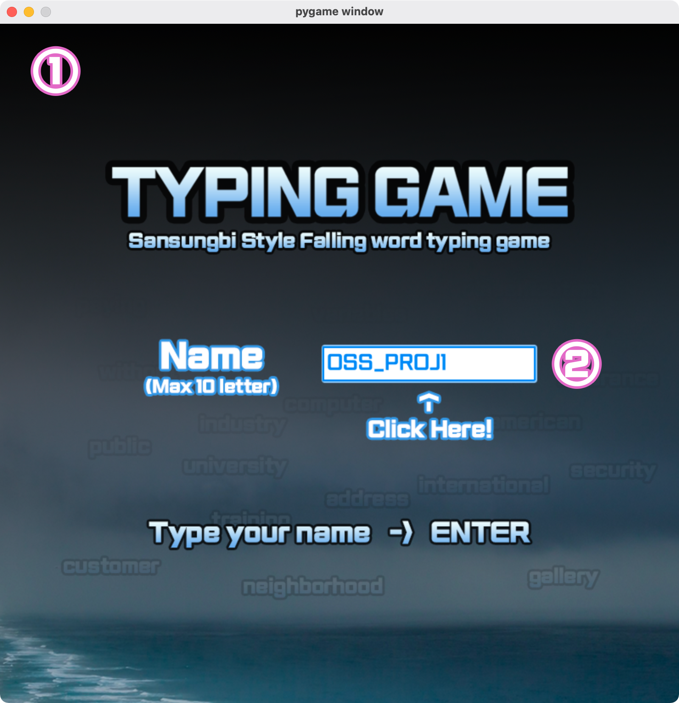

# 산성비 타자연습

## 소개
이 프로그램은 수업 시간에 배운 영단어 연습 프로그램을 python의 pygame 모듈을 활용하여 제작한 게임입니다. 제시된 단어를 최대한 빨리 입력하세요!

## 게임 실행 방법
### 1. 압축파일 다운로드
Code 버튼을 누르고 Download ZIP을 눌러 다운로드받으신 후, 압축 파일을 풀고 build 폴더의 실행 파일을 실행하시면 됩니다.
### 2. git으로 다운로드
Git Bash Shell, Terminal을 사용하여 다음 코드를 복사&붙여넣기하시고 실행하세요.
```
https://github.com/lshlsh3690/midTerm_typingGame/
```
본 프로그램을 직접 빌드하기 위해서는 **Python 3**와 **Pygame** 모듈이 설치되어 있어야 합니다. Python 3를 각 운영체제에 설치하신 다음 pip를 통해 pygame 모듈을 설치하세요.
```
pip3 install pygame
or 
pip install pygame
```
복사된 폴더의 main.py 코드를 python으로 실행하면 게임이 시작됩니다!

## 게임 시작 화면


### 시작화면의 구성요소
1. **배경 이미지**
2. **이름을 적는 공간(텍스트박스)**

프로그램 실행 시 바로 게임 시작 화면이 뜨며 타이틀 이미지(텍스트)와 이름을 적는 란이 나오게 됩니다. Name 글자 옆의 **하얀색 박스**를 클릭하면 박스가 하이라이트되면서 이름을 적을 수 있으며, 이름을 적고 **엔터 키**를 누르면 게임이 시작됩니다. 이름은 **영어**만 입력할 수 있으며 **10글자 제한**이 있습니다. (한글로 바꾸면 오류 발생)
이름을 적고 게임을 시작하면 데이터베이스에 이름과 함께 정보가 기록되기 시작합니다.

## 본게임 화면


### 본게임 화면의 구성요소
1. **플레이어 이름** <br> 타이틀 화면에서 입력한 이름이 여기에 표시됩니다.
2. **영단어 출현 영역** <br> 핑크색 경계선 위쪽에서 **영단어가 생성**되며 **아래쪽으로 하강**합니다. 영단어 생성 간격과 내려오는 속도는 전부 랜덤입니다. 영단어가 경계선 아래쪽에 닿을 경우 **단어가 사라지며 라이프가 1 감소**합니다.
3. **경과 시간** <br> 본 게임 화면이 뜨고 나서 게임이 종료할 때까지 **본 게임을 실행한 시간**이 표시됩니다.
4. **점수** <br> 단어를 올바로 입력하고 얻은 점수를 표시합니다. 점수 계산은 **맞게 입력한 단어의 글자수 * 20점**을 합산합니다.
5. **영단어 입력 공간** <br> 영단어를 입력하는 텍스트 박스입니다. 박스를 **한 번 누르면 활성화**되며 화면상에 존재하는 **올바른 단어를 입력하고 Enter키를 누르면** 단어가 없어지며 점수가 추가됩니다. **박스가 활성화되지 않거나 틀린 단어를 입력하고 Enter키를 누르면 라이프가 1 감소**합니다. 단어를 올바로 입력하고 Enter키를 누른 상황에서 다시 텍스트를 입력하면 텍스트가 초기화됩니다. 해당 박스도 마찬가지로 영어만 입력할 수 있습니다.
6. **라이프** <br> 위에서 언급한 대로 텍스트가 바닥 영역에 닿거나 틀린 답을 입력하면 1 감소합니다. 처음에는 **3개의 라이프**를 가지고 시작하며 라이프가 1 감소할 때마다 회색으로 하나씩 변합니다. **라이프가 다 감소하면 결과 화면으로 이동**합니다.

## 결과 화면

## 추가 소스 

### Pixabay 이미지 파일
Pixabay 라이센스는 특정 경우를 제외하고 모든 경우에서의 상업적 사용을 허가하고 있습니다.
https://pixabay.com/ko/service/license/

<a href="https://pixabay.com/ko/users/freesally-1311100/?utm_source=link-attribution&amp;utm_medium=referral&amp;utm_campaign=image&amp;utm_content=949448">구름과 바다 이미지</a> by Sally Wilson in Pixabay

<a href="https://pixabay.com/ko/users/mariamichelle-165491/?utm_source=link-attribution&amp;utm_medium=referral&amp;utm_campaign=image&amp;utm_content=685303">석양이 있는 구름과 바다 이미지</a> by Michelle Maria in Pixabay